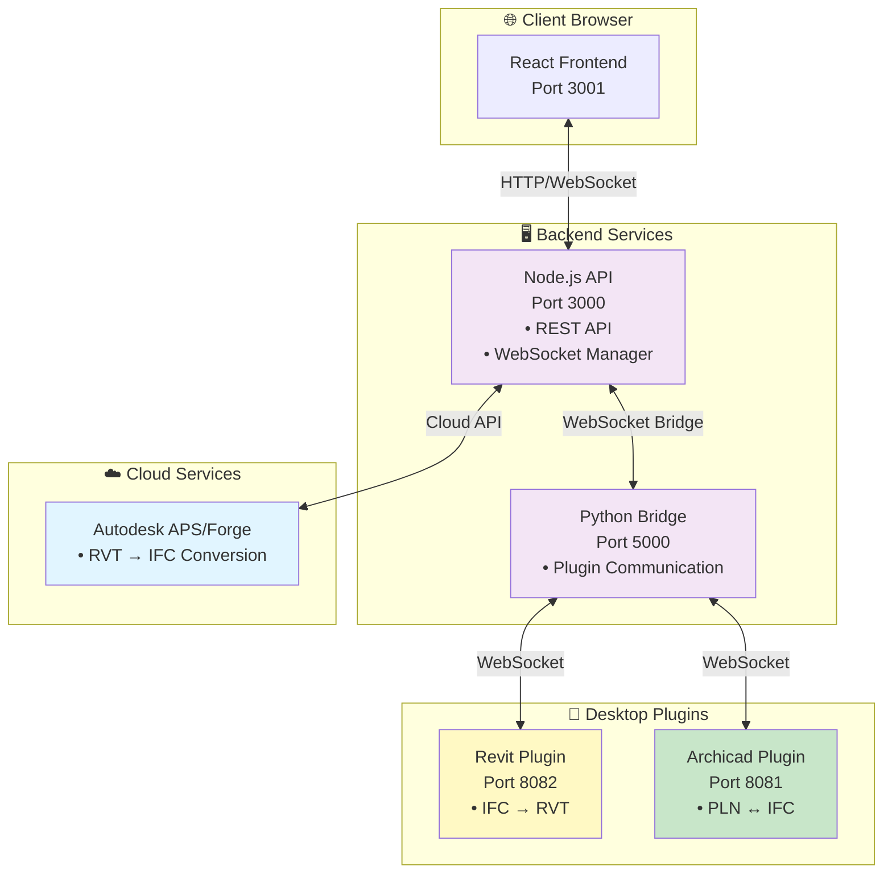
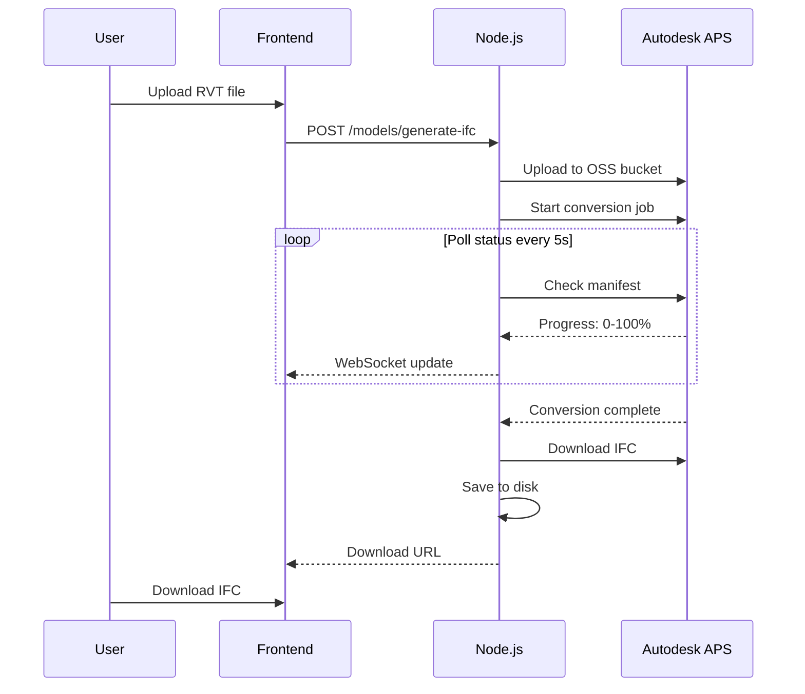
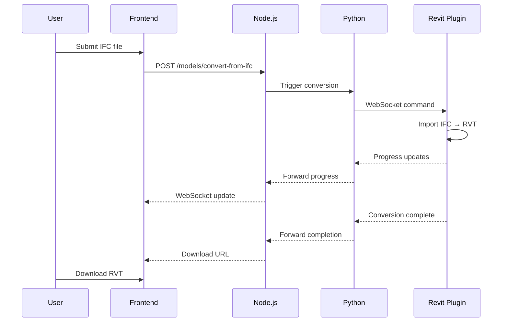
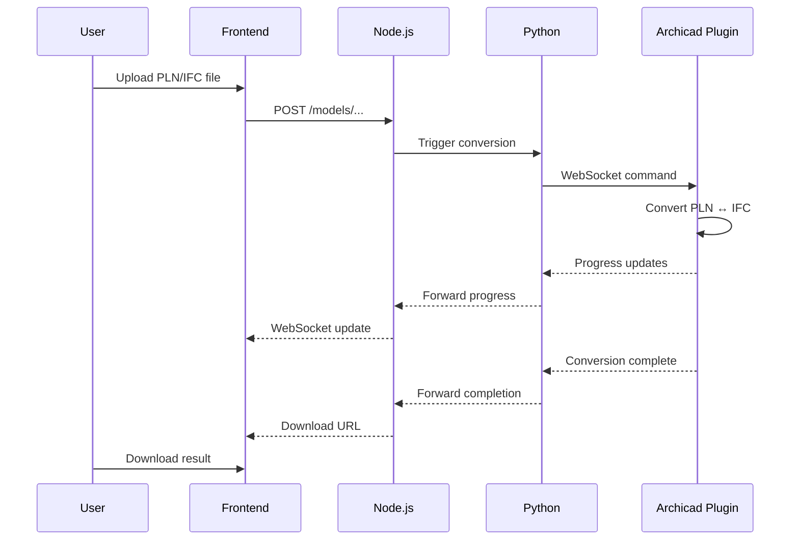

# ts-ifc-api

<p align="center">
<strong>BIM Interoperability API for Revit, Archicad and IFC</strong>
</p>

<p align="center">
  <a href="#-features">Features</a> •
  <a href="#-quick-start">Quick Start</a> •
  <a href="#-development">Development</a> •
  <a href="#-production">Production</a> •
  <a href="#-documentation">Documentation</a>
</p>

---

## 🎯 Goals

This project provides a complete **BIM interoperability layer** for architectural software, enabling seamless conversion between:

- **Revit** (.rvt) ↔ IFC
  - RVT → IFC: Cloud-based via **Autodesk Platform Services (APS/Forge)**
  - IFC → RVT: Local via **Revit Plugin**
- **Archicad** (.pln) ↔ IFC
  - Both directions via **Archicad Plugin** (local)
- **Revit** ↔ **Archicad** (via IFC as intermediate format)

### System Architecture Overview



### Key Components

- **REST API** (Node.js + TypeScript + Fastify)
- **Autodesk Platform Services** (Cloud conversion for RVT → IFC)
- **Python Bridge** (Flask + Plugin communication)
- **Desktop Plugins** (Revit C# + Archicad C++)
- **Web Interface** (React + TanStack Router)
- **Documentation** (Fumadocs + Code Hike)

---

## ✨ Features

- ✅ **Real-time conversion progress** via WebSocket
- ✅ **Multi-format support**: RVT, PLN, IFC
- ✅ **Chain conversions**: Automatic Revit → IFC → Archicad workflows
- ✅ **Plugin status monitoring** in real-time
- ✅ **Job management** with automatic cleanup (TTL-based)
- ✅ **Internationalization**: Portuguese and English support
- ✅ **File download** after conversion
- ✅ **RESTful API** with Scalar/Swagger documentation
- ✅ **WebSocket Context**: Global state management for jobs
- ✅ **Dark mode** support in web interface
- ✅ **Cross-platform backend** (Windows, Linux, macOS)
- ✅ **Drag-and-drop** file upload

---

## 🚀 Quick Start

### Prerequisites

- **Node.js** >= 18.0.0 (LTS recommended: 20.x)
- **pnpm** >= 8.0.0
- **Python** >= 3.8 (3.13+ recommended)

### Installation

**Windows:**

```bash
git clone https://github.com/Shobon03/ts-ifc-api.git
cd ts-ifc-api
scripts\setup.bat
```

**Linux/Mac:**

```bash
git clone https://github.com/Shobon03/ts-ifc-api.git
cd ts-ifc-api
chmod +x scripts/*.sh
./scripts/setup.sh
```

**Or manually:**

```bash
pnpm install
cd backend/python
python -m venv venv
source venv/bin/activate  # Windows: venv\Scripts\activate
pip install -r requirements.txt
```

---

## 💻 Development

Start all services in development mode with hot-reload:

```bash
pnpm dev
```

Or start services individually:

```bash
pnpm dev:backend        # Node.js API (port 3000)
pnpm dev:python         # Python bridge (port 5000)
pnpm dev:frontend       # React app (port 3001)
pnpm dev:documentation  # Fumadocs docs (port 3002)
```

### Ports After Initialization

| Service           | URL                        | Description                   |
| ----------------- | -------------------------- | ----------------------------- |
| **Backend API**   | http://localhost:3000      | Node.js REST API + WebSocket  |
| **Python Bridge** | http://localhost:5000      | Archicad plugin communication |
| **Frontend**      | http://localhost:3001      | React web interface           |
| **Documentation** | http://localhost:3002      | Fumadocs documentation site   |
| **API Reference** | http://localhost:3000/docs | Scalar API documentation      |

---

## 🏭 Production

### Build

**Windows:**

```bash
scripts\build.bat
```

**Linux/Mac:**

```bash
./scripts/build.sh
```

**Or with pnpm:**

```bash
pnpm build
```

### Run

**Windows:**

```bash
scripts\start.bat
```

**Linux/Mac:**

```bash
./scripts/start.sh
```

**Or with pnpm:**

```bash
pnpm start
```

### Production with PM2

```bash
# Install PM2
npm install -g pm2

# Build
pnpm build

# Start with PM2
pm2 start ecosystem.config.js

# Configure to start on boot
pm2 startup
pm2 save
```

For detailed build and deployment instructions, see **[BUILD.md](BUILD.md)**.

---

## 📚 Documentation

Complete documentation is available at **http://localhost:3002** (when running `pnpm dev:documentation`).

### User Guide

- **Introduction**: What is the system and how it works
- **Getting Started**: Your first conversion
- **File Conversion**: Detailed guide for all conversion types
- **Troubleshooting**: Common issues and solutions

### Developer Guide

- **Architecture**: System overview and component interaction
- **Setup**: Environment configuration
- **Backend Node.js**: Fastify API and WebSocket
- **Backend Python**: Flask bridge and Archicad integration
- **Frontend**: React application with TanStack Router

### Plugin Development

- **Revit Plugin**: C# WebSocket plugin for **IFC → RVT import** (RVT → IFC handled by APS)
- **Archicad Plugin**: C++ plugin for **bidirectional PLN ↔ IFC conversion**

### API Reference

- **Endpoints**: Complete REST API documentation
- **WebSocket Protocol**: Real-time communication spec
- **Data Models**: TypeScript types and Zod schemas

### Quick Links

- [Frontend README](frontend/README.md)
- [Backend Node.js README](backend/node/README.md)
- [Backend Python README](backend/python/README.md)
- [Revit Plugin README](plugins/revit/IfcToRevitConverter/README.md)
- [Archicad Plugin README](plugins/archicad/ArchiCAD-IFC-Plugin/README.md)
- [Architecture Overview](ARCHITECTURE.md)
- [Architectural Decisions](ARCHITECTURAL_DECISIONS.md)
- [Build Instructions](BUILD.md)
- [Deploy Checklist](DEPLOY_CHECKLIST.md)

---

## 🏗️ Project Structure

```
ts-ifc-api/
├── backend/
│   ├── node/                 # Fastify REST API + WebSocket
│   │   ├── src/
│   │   │   ├── routes/      # API endpoints
│   │   │   ├── services/    # Business logic
│   │   │   ├── ws/          # WebSocket handlers
│   │   │   ├── types/       # TypeScript types
│   │   │   ├── utils/       # Utilities
│   │   │   └── tests/       # Unit tests
│   │   └── README.md
│   └── python/              # Flask + Archicad API bridge
│       ├── src/
│       │   ├── server.py    # Flask application
│       │   └── archicad/    # Archicad integration
│       └── README.md
├── frontend/                # React web application
│   ├── src/
│   │   ├── routes/         # TanStack Router pages
│   │   ├── components/     # React components
│   │   ├── lib/            # WebSocket, i18n, utils
│   │   └── assets/         # Styles and static files
│   └── README.md
├── plugins/
│   ├── revit/              # Revit C# plugin (95% complete)
│   │   └── IfcToRevitConverter/
│   │       └── README.md
│   └── archicad/           # Archicad C++ plugin (65% complete)
│       └── ArchiCAD-IFC-Plugin/
│           ├── BUILD_INSTRUCTIONS.md
│           └── README.md
├── documentation/          # Fumadocs documentation site (Next.js 15)
│   ├── content/docs/
│   │   ├── user-guide/
│   │   ├── developer-guide/
│   │   ├── plugins/
│   │   └── api/
│   └── README.md
├── scripts/                # Build and setup automation
│   ├── setup.bat / setup.sh
│   ├── build.bat / build.sh
│   └── start.bat / start.sh
├── BUILD.md               # Detailed build instructions
├── DEPLOY_CHECKLIST.md    # Production deployment guide
└── README.md              # This file
```

---

## 🔧 Technology Stack

### Backend

- **Node.js** 18+ with TypeScript (20.x LTS recommended)
- **Fastify** 5.6 - Fast web framework
- **Zod** 4.1 - Schema validation
- **@fastify/websocket** - WebSocket support
- **Axios** - HTTP client
- **APS SDK** - Autodesk Platform Services (for RVT → IFC cloud conversion)

### Frontend

- **React** 19.2 - UI library
- **TanStack Router** 1.133 - File-based routing
- **TanStack Query** 5.90 - Server state management
- **Tailwind CSS** 4.1 - Styling
- **Vite** 7.1 - Build tool
- **React Hook Form** + **Zod** - Form validation
- **Lucide React** - Icons

### Python Bridge

- **Flask** 3.1 - Web framework
- **Archicad** 28.3000 - Archicad API

### Plugins

- **Revit API 2025.4** + **.NET 8.0** (C#)
- **Archicad API DevKit 28.4** + **C++17**
- **Boost.Beast** - WebSocket/HTTP (Archicad)
- **WebSocketSharp** - WebSocket server (Revit)

### Documentation

- **Fumadocs** - Documentation framework (Next.js 15)
- **Code Hike** - Code highlighting and annotations
- **MDX** - Markdown with React components

---

## 🚦 System Status

| Component       | Status              | Completeness |
| --------------- | ------------------- | ------------ |
| Backend Node.js | ✅ Production Ready | 100%         |
| Backend Python  | ✅ Production Ready | 100%         |
| Frontend        | ✅ Production Ready | 100%         |
| Revit Plugin    | ✅ Production Ready | 100%         |
| Archicad Plugin | ✅ Production Ready | 100%         |
| Documentation   | ✅ Complete         | 100%         |

### Conversion Methods

| Conversion | Method   | Technology                             |
| ---------- | -------- | -------------------------------------- |
| RVT → IFC  | ☁️ Cloud | Autodesk Platform Services (APS/Forge) |
| IFC → RVT  | 🖥️ Local | Revit Plugin + Python Bridge           |
| PLN → IFC  | 🖥️ Local | Archicad Plugin + Python Bridge        |
| IFC → PLN  | 🖥️ Local | Archicad Plugin + Python Bridge        |

### Conversion Flow Diagrams

#### RVT → IFC (Cloud-based via APS)



#### IFC → RVT (Local via Revit Plugin)



#### PLN ↔ IFC (Local via Archicad Plugin)



### Current Features

- ✅ **Complete conversion pipeline**: All formats fully supported (RVT ↔ IFC ↔ PLN)
- ✅ **Hybrid architecture**: Cloud (APS) for RVT→IFC, Local plugins for other conversions
- ✅ **Real-time progress tracking**: WebSocket communication for all conversions
- ✅ **Production ready**: All components tested and stable
- ℹ️ **IFC Validation**: UI available, backend integration planned for future release

---

## 🤝 Contributing

Contributions are welcome! Please follow these guidelines:

1. **Fork** the repository
2. **Create** a feature branch (`git checkout -b feature/amazing-feature`)
3. **Commit** your changes (`git commit -m 'Add amazing feature'`)
4. **Push** to the branch (`git push origin feature/amazing-feature`)
5. **Open** a Pull Request

### Development Setup

See [BUILD.md](BUILD.md) for detailed development environment setup.

### Future Enhancements

- IFC validation backend integration
- Extended unit and integration test coverage
- Docker containerization
- Performance optimizations for large models
- Additional IFC schema versions support

---

## 📝 License

This project is licensed under GPL-3.0 - see [LICENSE](LICENSE) for more details.

## About

This project is a part of my final thesis for my undergraduate Computer Science degree.
