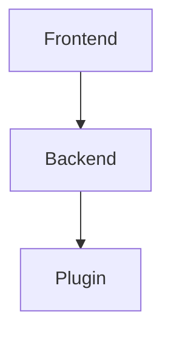

# Documentação do Sistema de Interoperabilidade BIM

Documentação completa criada com **Fumadocs** e **Code Hike**.

## 📚 Estrutura da Documentação

A documentação está organizada em 4 seções principais:

### 1. **Guia do Usuário** (`/user-guide/`)
Para usuários finais que vão usar o sistema via interface web:

- **introduction.mdx**: O que é o sistema, para que serve, conceitos básicos de IFC
- **getting-started.mdx**: Como acessar e fazer a primeira conversão
- **file-conversion.mdx**: Guia completo de todos os tipos de conversão (Revit→IFC, Archicad→IFC, IFC→Revit)
- **validation.mdx**: Como validar arquivos IFC, interpretar relatórios de validação
- **troubleshooting.mdx**: Solução de problemas comuns, erros e como resolvê-los

### 2. **Guia do Desenvolvedor** (`/developer-guide/`)
Para desenvolvedores que vão contribuir ou executar o sistema localmente:

- **architecture.mdx**: Arquitetura completa do sistema, componentes, fluxo de dados
- **setup.mdx**: Como configurar o ambiente de desenvolvimento (Node.js, Python, variáveis de ambiente)
- **backend-node.mdx**: Estrutura do backend Fastify, serviços, rotas, schemas
- **backend-python.mdx**: Servidor Flask para integração Archicad
- **frontend.mdx**: Aplicação React, componentes, hooks, roteamento

### 3. **Plugins** (`/plugins/`)
Instruções detalhadas para compilar e instalar plugins nativos:

- **revit.mdx**: Plugin C# para Revit 2025.4 (Visual Studio 2022, .NET 8, WebSocket)
- **archicad.mdx**: Plugin C++ para Archicad 28.4 (Visual Studio 2019, CMake, API DevKit)

### 4. **Referência da API** (`/api/`)
Documentação técnica completa da API:

- **endpoints.mdx**: Todos os endpoints REST (POST /models/generate-ifc, POST /models/validate, GET /health)
- **websockets.mdx**: Protocolo WebSocket para comunicação em tempo real
- **models.mdx**: Tipos TypeScript, Zod schemas, modelos de dados

## 🚀 Como Rodar a Documentação

### Desenvolvimento

```bash
# Na raiz do monorepo
npm run dev:documentation

# Ou diretamente na pasta documentation
cd documentation
npm run dev
```

A documentação estará disponível em: **http://localhost:3002**

### Build de Produção

```bash
cd documentation
npm run build

# Arquivos estáticos gerados em: documentation/.next/
```

### Preview da Build

```bash
npm run start
```

## 📝 Tecnologias Utilizadas

- **Fumadocs**: Framework de documentação baseado em Next.js 15
- **Code Hike**: Syntax highlighting e anotações de código interativas
- **MDX**: Markdown + React components
- **Tailwind CSS**: Estilização
- **TypeScript**: Type safety

## 📖 Navegação da Documentação

A documentação possui navegação hierárquica definida em [`content/docs/meta.json`](content/docs/meta.json):

```json
{
  "title": "Documentação",
  "pages": [
    "index",
    "---Guia do Usuário---",
    "user-guide/introduction",
    "user-guide/getting-started",
    "user-guide/file-conversion",
    "user-guide/validation",
    "user-guide/troubleshooting",
    "---Guia do Desenvolvedor---",
    "developer-guide/architecture",
    "developer-guide/setup",
    "developer-guide/backend-node",
    "developer-guide/backend-python",
    "developer-guide/frontend",
    "---Plugins---",
    "plugins/revit",
    "plugins/archicad",
    "---Referência da API---",
    "api/endpoints",
    "api/websockets",
    "api/models"
  ]
}
```

## ✨ Recursos Especiais

### Componentes Fumadocs

A documentação utiliza componentes interativos do Fumadocs:

```mdx
import { Callout } from 'fumadocs-ui/components/callout';
import { Cards, Card } from 'fumadocs-ui/components/card';
import { Steps, Step } from 'fumadocs-ui/components/steps';
import { Tabs, Tab } from 'fumadocs-ui/components/tabs';

<Callout type="info" title="Importante">
  Mensagem destacada
</Callout>

<Cards>
  <Card title="Título" description="Descrição" href="/link" />
</Cards>

<Steps>
  <Step>Passo 1</Step>
  <Step>Passo 2</Step>
</Steps>
```

### Code Hike

Blocos de código com syntax highlighting avançado:

````mdx
```typescript
// Código TypeScript com highlighting
const example: Type = {
  property: 'value'
}
```
````

### Mermaid Diagrams

Diagramas renderizados automaticamente:

````mdx

````

## 📦 Arquivos Criados

**Total: 17 arquivos MDX + 1 meta.json**

### Guia do Usuário (4 páginas)
- ✅ introduction.mdx
- ✅ getting-started.mdx
- ✅ file-conversion.mdx
- ✅ validation.mdx
- ✅ troubleshooting.mdx

### Guia do Desenvolvedor (5 páginas)
- ✅ architecture.mdx
- ✅ setup.mdx
- ✅ backend-node.mdx
- ✅ backend-python.mdx
- ✅ frontend.mdx

### Plugins (2 páginas)
- ✅ revit.mdx
- ✅ archicad.mdx

### API Reference (3 páginas)
- ✅ endpoints.mdx
- ✅ websockets.mdx
- ✅ models.mdx

### Outros
- ✅ index.mdx (página inicial)
- ✅ meta.json (navegação)

## 🎯 Próximos Passos

### Para Usuários Finais
1. Acesse a documentação em http://localhost:3002
2. Leia o [Guia do Usuário → Introdução](/docs/user-guide/introduction)
3. Siga o [Primeiros Passos](/docs/user-guide/getting-started)
4. Faça sua primeira conversão!

### Para Desenvolvedores
1. Leia a [Arquitetura](/docs/developer-guide/architecture)
2. Configure o ambiente seguindo o [Setup](/docs/developer-guide/setup)
3. Compile os plugins:
   - [Plugin Revit](/docs/plugins/revit)
   - [Plugin Archicad](/docs/plugins/archicad)
4. Consulte a [API Reference](/docs/api/endpoints) quando necessário

## 📞 Suporte

- **Repositório**: [github.com/Shobon03/ts-ifc-api](https://github.com/Shobon03/ts-ifc-api)
- **Issues**: [github.com/Shobon03/ts-ifc-api/issues](https://github.com/Shobon03/ts-ifc-api/issues)
- **Autor**: Matheus Piovezan Teixeira
- **Licença**: GNU General Public License v3.0

---

**Desenvolvido como parte do TCC sobre Interoperabilidade BIM utilizando Design Science Research (DSR)**

*Última atualização: Janeiro 2025*
