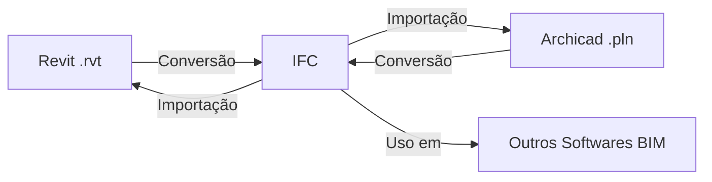

import { Card, Cards } from 'fumadocs-ui/components/card';

## Bem-vindo

O **Sistema de Interoperabilidade BIM** é uma plataforma completa para facilitar a troca de informações entre diferentes softwares de modelagem arquitetônica, especialmente **Autodesk Revit** e **Graphisoft Archicad**.

### O que você pode fazer

<Cards>
  <Card
    title="Converter Revit para IFC"
    description="Transforme arquivos .rvt em formato IFC universal usando Autodesk Forge"
    href="/docs/user-guide/file-conversion#revit-para-ifc"
  />
  <Card
    title="Converter Archicad para IFC"
    description="Exporte projetos .pln para o formato IFC padrão"
    href="/docs/user-guide/file-conversion#archicad-para-ifc"
  />
  <Card
    title="IFC para Revit"
    description="Importe modelos IFC de volta para o Revit como arquivos .rvt"
    href="/docs/user-guide/file-conversion#ifc-para-revit"
  />
  <Card
    title="Validar Arquivos IFC"
    description="Verifique a integridade e conformidade de arquivos IFC"
    href="/docs/user-guide/validation"
  />
</Cards>

## O que é IFC?

**IFC (Industry Foundation Classes)** é um formato de arquivo padrão internacional para Building Information Modeling (BIM). Funciona como um "tradutor universal" permitindo que diferentes softwares de arquitetura compartilhem informações de forma padronizada.



## Arquitetura do Sistema

O sistema é composto por múltiplos componentes que trabalham em conjunto:

```typescript
// Estrutura do Projeto
{
  "backend": {
    "node": "API REST com Fastify + WebSocket",
    "python": "Servidor Flask para integração Archicad"
  },
  "frontend": "Interface React com TanStack Router",
  "plugins": {
    "revit": "Add-in C# para Revit 2025.4",
    "archicad": "Add-on C++ para Archicad 28.4"
  },
  "external": {
    "forge": "Autodesk Platform Services (APS)"
  }
}
```

## Recursos Principais

### Para Usuários Finais

- Interface web intuitiva e responsiva
- Upload e conversão de arquivos com drag-and-drop
- Acompanhamento de progresso em tempo real via WebSocket
- Validação automática de arquivos IFC
- Download automático de arquivos convertidos
- Suporte para arquivos grandes (até 100MB)

### Para Desenvolvedores

- **API REST** completa com documentação Swagger
- **WebSocket** para comunicação em tempo real
- **Plugins nativos** para Revit e Archicad
- **Validação robusta** com Zod schemas
- **Rate limiting** e segurança configurável
- **Arquitetura modular** com workspaces npm
- **TypeScript** end-to-end para type safety

## Tecnologias Utilizadas

<Cards>
  <Card title="Backend Node.js" description="Fastify 5, TypeScript, Zod, WebSocket" />
  <Card title="Backend Python" description="Flask 3, Archicad API DevKit 28" />
  <Card title="Frontend" description="React 19, TanStack Router/Query, Tailwind CSS" />
  <Card title="Plugins" description="C# (.NET 8), C++ (CMake), WebSocket" />
  <Card title="External APIs" description="Autodesk Forge/APS" />
  <Card title="Docs" description="Fumadocs, Code Hike, Next.js 15" />
</Cards>

## Começando

<Cards>
  <Card
    title="Guia do Usuário"
    description="Aprenda a usar o sistema para converter e validar arquivos"
    href="/docs/user-guide/introduction"
  />
  <Card
    title="Guia do Desenvolvedor"
    description="Configure o ambiente de desenvolvimento e entenda a arquitetura"
    href="/docs/developer-guide/architecture"
  />
  <Card
    title="Configurar Plugins"
    description="Instruções detalhadas para compilar e instalar os plugins"
    href="/docs/plugins/revit"
  />
  <Card
    title="Referência da API"
    description="Documentação completa de todos os endpoints e modelos"
    href="/docs/api/endpoints"
  />
</Cards>

## Metodologia

Este projeto foi desenvolvido utilizando a metodologia **Design Science Research (DSR)**, que combina:

1. **Identificação do problema**: Dificuldade de interoperabilidade entre softwares BIM
2. **Definição dos objetivos**: Criar sistema universal de conversão
3. **Design e desenvolvimento**: Implementação da solução técnica
4. **Demonstração**: Validação com casos de uso reais
5. **Avaliação**: Testes e refinamento
6. **Comunicação**: Documentação e compartilhamento

## Licença e Contribuições

**Licença**: GNU General Public License v3.0 (GPL-3.0)

**Autor**: Matheus Piovezan Teixeira

**Repositório**: [github.com/Shobon03/ts-ifc-api](https://github.com/Shobon03/ts-ifc-api)

Este projeto é parte de um Trabalho de Conclusão de Curso (TCC) focado em interoperabilidade BIM.

## Suporte

Para dúvidas, problemas ou sugestões:

- Consulte a seção [Troubleshooting](/docs/user-guide/troubleshooting)
- Abra uma issue no GitHub
- Entre em contato com o desenvolvedor

---

**Próximos passos**: Explore o [Guia do Usuário](/docs/user-guide/introduction) para começar a usar o sistema, ou o [Guia do Desenvolvedor](/docs/developer-guide/setup) se você quer contribuir com o projeto.
