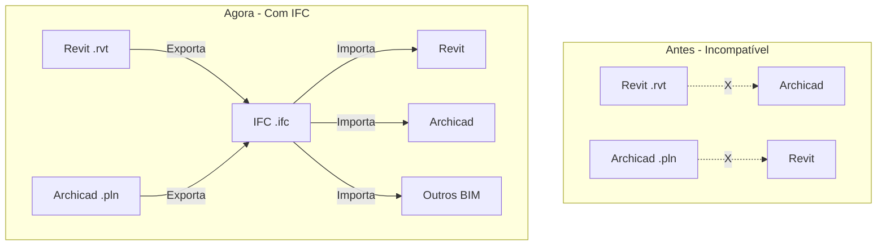

import { Callout } from 'fumadocs-ui/components/callout';

## Bem-vindo ao Sistema de Interoperabilidade BIM

O Sistema de Interoperabilidade BIM é uma plataforma web criada para resolver um problema comum na indústria da construção: **a dificuldade de compartilhar modelos 3D entre diferentes softwares de arquitetura**.

### O Problema

Imagine a seguinte situação:

- Você trabalha com **Revit** e cria um projeto arquitetônico completo
- Seu parceiro de projeto usa **Archicad**
- Como vocês compartilham o modelo sem perder informações?

Cada software BIM usa seu próprio formato de arquivo proprietário:
- Revit usa `.rvt`
- Archicad usa `.pln`
- Outros softwares têm seus próprios formatos

<Callout title="O Problema da Incompatibilidade">
  Arquivos `.rvt` não abrem no Archicad, e arquivos `.pln` não abrem no Revit. Isso dificulta a colaboração entre profissionais que usam ferramentas diferentes.
</Callout>

### A Solução: IFC

O formato **IFC (Industry Foundation Classes)** foi criado justamente para resolver esse problema. É um formato **universal e aberto** que qualquer software BIM pode ler e escrever.

Pense no IFC como:
- Um "PDF" para arquivos BIM
- Um tradutor universal entre softwares
- Uma linguagem comum que todos entendem



### O que o Sistema Faz

O sistema automatiza e facilita todo o processo de conversão:

1. **Converte Revit para IFC**: Usando a nuvem da Autodesk (Forge/APS)
2. **Converte Archicad para IFC**: Através de plugin local
3. **Converte IFC para Revit**: Para reimportar modelos universais
4. **Valida arquivos IFC**: Verifica se estão corretos e completos

### Vantagens do Sistema

- **Interface Simples**: Você não precisa ser um expert em BIM. A interface é intuitiva e fácil de usar.
- **Processamento Automático**: Apenas faça upload do arquivo e deixe o sistema fazer todo o trabalho.
- **Progresso em Tempo Real**: Acompanhe cada etapa da conversão com feedback visual constante.
- **Validação Integrada**: Verifique se seus arquivos IFC estão corretos antes de compartilhar.

## Quem Pode Usar

### Usuários Finais

Você **NÃO precisa** ter Revit ou Archicad instalados no seu computador para usar o sistema web. Apenas:

- Um navegador moderno (Chrome, Firefox, Edge, Safari)
- Conexão com a internet
- Seus arquivos BIM (`.rvt`, `.pln` ou `.ifc`)

<Callout type="info">
  O sistema roda completamente na nuvem. Todo o processamento acontece nos servidores, não no seu computador.
</Callout>

### Desenvolvedores

Se você quer executar o sistema localmente ou contribuir com o projeto, precisará de:

- Conhecimentos em TypeScript/JavaScript
- Node.js, Python (opcional)
- Para trabalhar com plugins: Revit 2025.4 e/ou Archicad 28.4

Consulte o [Guia do Desenvolvedor](/docs/developer-guide/setup) para mais informações.

## O que NÃO é o Sistema

Para evitar confusões, é importante esclarecer:

❌ **NÃO é um editor BIM**: Você não pode editar modelos 3D no sistema
❌ **NÃO é um visualizador**: Não exibe os modelos 3D (apenas converte)
❌ **NÃO substitui Revit/Archicad**: É uma ferramenta complementar
❌ **NÃO armazena arquivos**: Seus projetos são deletados após a conversão

✅ **É um conversor**: Transforma arquivos entre formatos
✅ **É um validador**: Verifica a integridade de IFCs
✅ **É uma ponte**: Conecta diferentes softwares BIM

## Casos de Uso Comuns

### 1. Colaboração entre Equipes

**Situação**: Arquiteto usa Revit, engenheiro estrutural usa Archicad

**Solução**:
1. Arquiteto exporta `.rvt` para IFC no sistema
2. Engenheiro importa IFC no Archicad
3. Engenheiro trabalha no projeto
4. Engenheiro exporta `.pln` para IFC
5. Arquiteto importa IFC de volta no Revit

### 2. Migração de Software

**Situação**: Escritório decide migrar do Archicad para o Revit

**Solução**:
1. Converter todos os projetos `.pln` para IFC
2. Importar IFCs no Revit usando o sistema
3. Ter os projetos antigos disponíveis no novo software

### 3. Entrega de Projetos

**Situação**: Cliente ou órgão público exige formato IFC

**Solução**:
1. Fazer upload do projeto (`.rvt` ou `.pln`)
2. Converter para IFC
3. Validar o IFC gerado
4. Entregar arquivo validado

### 4. Integração com Outros Softwares

**Situação**: Usar modelo em software de análise energética, estrutural, etc.

**Solução**:
1. Converter projeto para IFC
2. Importar IFC no software especializado
3. Manter informações do modelo original

## Limitações e Considerações

É importante entender que nem tudo é perfeito nas conversões:

### Dados que SÃO Preservados

✅ Geometria 3D (paredes, pisos, tetos, portas, janelas)
✅ Propriedades básicas (materiais, dimensões, tipos)
✅ Estrutura hierárquica (níveis, zonas, grupos)
✅ Relações entre elementos (porta em parede, janela em parede)

### Dados que PODEM SER Perdidos

⚠️ Propriedades customizadas específicas de cada software
⚠️ Famílias paramétricas complexas
⚠️ Algumas anotações e dimensões
⚠️ Configurações de visualização específicas
⚠️ Scripts e automações

<Callout type="warn" title="Importante">
  Sempre verifique o arquivo convertido no software de destino para garantir que todas as informações essenciais foram preservadas.
</Callout>

## Fluxo de Trabalho Recomendado

Para obter os melhores resultados:

```typescript
// Fluxo ideal de conversão
const workflow = {
  step1: "Prepare o modelo no software original",
  // Remova elementos desnecessários
  // Verifique se não há erros no modelo
  // Salve uma versão limpa

  step2: "Faça upload no sistema",
  // Use a interface web
  // Aguarde a conversão

  step3: "Valide o IFC gerado",
  // Use o validador do sistema
  // Corrija erros se houver

  step4: "Teste no software de destino",
  // Abra o arquivo convertido
  // Verifique elementos importantes
  // Confirme que tudo está correto

  step5: "Use em produção",
  // Compartilhe com a equipe
  // Integre no fluxo de trabalho
}
```

## Próximos Passos

Agora que você entende o que é o sistema e para que serve, vamos aprender a usá-lo:

<Cards>
  <Card
    title="Primeiros Passos"
    description="Acesse o sistema e faça sua primeira conversão"
    href="/docs/user-guide/getting-started"
  />
  <Card
    title="Converter Arquivos"
    description="Guia detalhado de cada tipo de conversão"
    href="/docs/user-guide/file-conversion"
  />
  <Card
    title="Validar IFC"
    description="Aprenda a verificar a qualidade dos arquivos"
    href="/docs/user-guide/validation"
  />
</Cards>

## Dúvidas Frequentes

### O sistema é gratuito?

Depende da implantação. A versão open source é gratuita. Para usar o serviço na nuvem com Autodesk Forge, é necessário ter credenciais da Autodesk.

### Meus arquivos ficam salvos no servidor?

**Não**. Os arquivos são processados e imediatamente deletados após a conversão por questões de segurança e privacidade.

### Quanto tempo demora uma conversão?

Depende do tamanho do arquivo:
- Pequeno (< 10MB): 1-2 minutos
- Médio (10-50MB): 3-5 minutos
- Grande (50-100MB): 5-10 minutos

### Qual o tamanho máximo de arquivo?

Atualmente **100MB**. Para arquivos maiores, considere dividir o modelo ou reduzir o nível de detalhe.

### O sistema funciona offline?

**Não**. Ele requer internet para:
- Acessar a interface web
- Fazer upload/download
- Processar conversões na nuvem

---

Pronto para começar? Vá para [Primeiros Passos](/docs/user-guide/getting-started) e faça sua primeira conversão!
